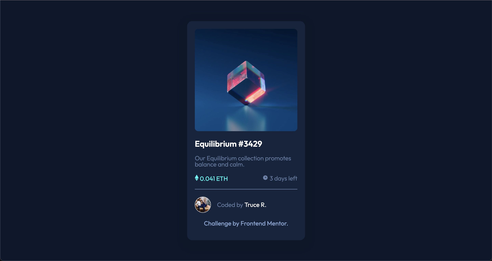

# Frontend Mentor - NFT preview card component solution

## Table of contents

- [Overview](#overview)
  - [The challenge](#the-challenge)
  - [Screenshot](#screenshot)
  - [Links](#links)
- [My process](#my-process)
  - [Built with](#built-with)
  - [Continued development](#continued-development)
  - [Useful resources](#useful-resources)
- [Author](#author)
- [Acknowledgments](#acknowledgments)

## Overview

This is a solution to the [NFT preview card component challenge on Frontend Mentor](https://www.frontendmentor.io/challenges/nft-preview-card-component-SbdUL_w0U). Frontend Mentor challenges help you improve your coding skills by building realistic projects.

### The challenge

Users should be able to:

- View the optimal layout depending on their device's screen size
- See hover states for interactive elements

### Screenshot



### Links

- Solution:([Solution](https://www.frontendmentor.io/solutions/nft-preview-card-challenge-oDNOGcK5nk))
- Live Site:([Live Site](https://devtruce.github.io/nft-preview-card/))

## My process

I had a fun time with this challenge and it was great to help get some real practice while
learning, I enjoyed using flexbox to layout the elements and for the most part I think I did the
challenge relatively well for where I am at in my learning journey. I am disappointed that I was
unable to get the hover effect correct on the image but I will come back to that and get it
working correctly.

### Built with

- HTML5
- CSS3
- Flexbox

```html
<section class="eth-container">
  <span class="eth">
     0.041 ETH
  </span>
  <span class="clock">
     3 days left
  </span>
</section>
```

```css
.attribution a:hover,
.attribution a:focus,
.card-headertxt:hover,
.card-headertxt:focus,
.truce-container a:hover,
.truce-container a:focus {
  color: hsl(178, 100%, 50%);
  cursor: pointer;
  transition: color 200ms ease-in-out;
}

.card {
  background-color: hsl(216, 50%, 16%);
  display: flex;
  flex-direction: column;
  /* justify-content: flex-start;
  align-items: center; */
  border-radius: 15px;
  max-height: 750px;
  max-width: 300px;
  padding: 1.25rem;
  box-shadow: 0px 10px 20px 30px #0c1729;
}

.card-img {
  border-radius: 10px;
  width: 500px;
  height: 300px;
  background: url(images/image-equilibrium.jpg);
  background-position: center;
  background-size: cover;
  background-repeat: no-repeat;
  max-height: 100%;
  max-width: 100%;
}

.card-img:hover,
.card-img:focus {
  background-image: url(images/icon-view.svg);
  background-position: center;
  background-size: cover;
  background-repeat: no-repeat;
  background-color: hsla(178, 100%, 50%, 0.555);
  opacity: 0.6;
  transition: all 500ms ease-in-out;
}
```

### Continued development

I want to focus on semantic html, flexbox and image overlays/transitions as well as the units
I used when sizing elements.

### Useful resources

- [CSS background-image MDN Docs](https://developer.mozilla.org/en-US/docs/Web/CSS/background-image) - This helped me get a better understanding for the attribue and helped me
  get a closer hover effect to the challenge but I still have to figure out how to get the exact
  hover effect.

## Author

- Frontend Mentor - [@DevTruce](https://www.frontendmentor.io/profile/DevTruce)

## Acknowledgments

I need to keep studying xd.
